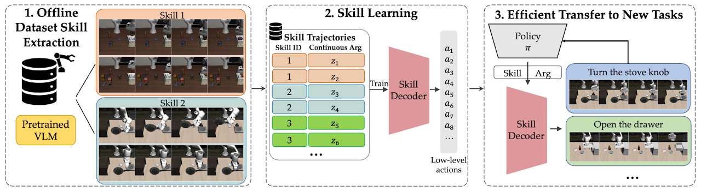

# EXTRACT: Efficient Policy Learning by Extracting Transferable Robot Skills from Offline Data
#### [[Project Website]](https://jessezhang.net/projects/extract) [[Paper]](https://arxiv.org/abs/2406.17768)

[Jesse Zhang](https://jessezhang.net)<sup>1</sup>, 
[Minho Heo](https://minoring.github.io/)<sup>2</sup>, 
[Zuxin Liu](https://zuxin.me/)<sup>3</sup>,
[Erdem Bıyık](https://ebiyik.github.io/)<sup>1</sup>,
[Joseph J. Lim](https://www.clvrai.com/)<sup>2</sup>,
[Yao Liu](http://yao-liu.com/)<sup>4</sup>,
[Rasool Fakoor](https://sites.google.com/site/rfakoor)<sup>4</sup>

<sup>1</sup>University of Southern California 
<sup>2</sup>KAIST 
<sup>3</sup>Carnegie Mellon University
<sup>4</sup>Amazon Web Services

<a href="https://clvrai.github.io/extract/">
<p align="center">

</p>
</img></a>

This is the official PyTorch implementation of the paper "**EXTRACT: Efficient Policy Learning by Extracting Transferable Robot Skills from Offline Data**"
(CoRL 2024).

## Requirements

- python 3.10+
- mujoco 2.0.2.5 (for RL experiments)
- Ubuntu

## Installation Instructions
Use conda to install all required packages.
Make sure you already have mujoco installed, follow instructions [here](https://www.roboti.us/download.html) or run:
```
# Mujoco installation for linux
mkdir ~/.mujoco
cd ~/.mujoco
wget https://www.roboti.us/download/mujoco200_linux.zip
unzip mujoco200_linux.zip
mv mujoco200_linux mujoco200
wget https://www.roboti.us/file/mjkey.txt
```

Now, to finalize mujoco install, add the following lines to your `~/.bashrc`:
```
export MJLIB_PATH=$HOME/.mujoco/mujoco200/bin/libmujoco200.so
export LD_LIBRARY_PATH=$LD_LIBRARY_PATH:$HOME/.mujoco/mujoco200/bin
export MUJOCO_GL=egl # maybe not necessary for you
export LD_LIBRARY_PATH=$LD_LIBRARY_PATH:/usr/lib/nvidia
export LD_LIBRARY_PATH=$LD_LIBRARY_PATH:/usr/local/lib
```

Now conda install everything else:
```
conda env create -f environment.yml
conda activate extract
pip install -e .
pip install -r requirements.txt
```

Set the environment variables that specify the root experiment and data directories. For example: 
```
mkdir ./experiments
mkdir ./data
export EXP_DIR=./experiments
export DATA_DIR=./data
```

Finally, install our D4RL fork:
```
conda activate extract
pip install -e d4rl
```

## Running our Clustering Pipeline
### Franka Kitchen

First, generate the kitchen dataset.
```
python data_generation_scripts/generate_kitchen_data.py
```
This replays the actions in the D4RL Franka Kitchen environment to get RGB observations and then generates a corresponding dataset for that.

Now, run the clustering algorithm with default parameters (K-means `K=8`, Median filtering with a window size of `7`):

```
python vlm_cluster_dataset.py kitchen
```
### LIBERO Dataset
First, download the LIBERO dataset, see full instructions [here](https://github.com/Lifelong-Robot-Learning/LIBERO) or follow the below instructions:
```
git submodule update --init --recursive
pip install -e LIBERO
cd LIBERO
python benchmark_scripts/download_libero_datasets.py
```
Then, move the downloaded LIBERO datasets to `./datasets/`.

Now, generate our version of the LIBERO dataset:
```
python data_generation_scripts/generate_libero_data_for_clustering.py # for the clustering algorithm
python data_generation_scripts/generate_libero_data_lmdb_lowres.py # for actual policy training
```

Now, run the clustering algorithm with default parameters (K-means `K=8`, Median filtering with a window size of `7`):

```
python vlm_cluster_dataset.py libero
```
# Running commands
Training EXTRACT consists of either 2 or 3 stages:
(1) Training a skill prior model and low-level decoder w/ a VAE on the offline skill dataset
(2) (Optional, used for LIBERO) Fine-tuning the whole VAE on a target-task specific dataset 
(3) Running online RL to learn new tasks.

## (1) Training skill models
All results will be written to [WandB](https://www.wandb.com/). Before running any of the commands below, 
create an account and then change the WandB entity and project name at the top of [train.py](extract/train.py) and
[rl/train.py](extract/rl/train.py) to match your account.


For all commands below, if you want to run with multiple seeds, you can add a `--seed {SEED}` argument along with `--prefix {PREFIX}` to distinguish the saved model checkpoint folders from each other (e.g., set prefix to the seed). 

### Kitchen

To pre-train the skill learning VAE for EXTRACT on kitchen:
```
python extract/train.py --path=extract/configs/skill_prior_learning/kitchen/hierarchical_cluster/extract --val_data_size=160 --run_name {wandb_run_name}
```

To pre-train the skill learning VAE for SPiRL on kitchen:
```
python extract/train.py --path=extract/configs/skill_prior_learning/kitchen/hierarchical/ --val_data_size=160 --run_name {wandb_run_name}
```

To pre-train a flat BC policy on kitchen:
```
python extract/train.py --path=extract/configs/skill_prior_learning/kitchen/flat/ --val_data_size=160 --run_name {wandb_run_name}
```
### LIBERO 
All pre-training methods will be trained on the LIBERO-90 dataset. 

To pre-train the skill learning VAE for EXTRACT on libero:
```
python extract/train.py --path=extract/configs/skill_prior_learning/libero_lang/hierarchical_cluster/extract --val_data_size=160 --run_name {wandb_run_name}
```

To pre-train the skill learning VAE for SPiRL on libero:
```
python extract/train.py --path=extract/configs/skill_prior_learning/libero_lang/hierarchical/ --val_data_size=160 --run_name {wandb_run_name}
```

To pre-train a flat BC policy on libero:
```
python extract/train.py --path=extract/configs/skill_prior_learning/libero_lang/flat/ --val_data_size=160 --run_name {wandb_run_name}
```

NOTE: you can override any config parameter by passing --config_override OVERRIDE_1,OVERRIDE_2,
e.g.: `--config_override model.kl-div_weight=1e-4,model.nz_vae=5`

## (2) Fine-tuning 
This is an optional step that we use for LIBERO. If building on EXTRACT, then if you have downstream task demonstrations, then you should write a config to run this step for your custom task/dataset. Otherwise, skip.


### LIBERO
Double check to make sure that the experiment config file in the `--path` argument points to the correct pre-trained skill model checkpoint location. By default it should, but if you moved things around or used a `--prefix` it may need to be different.
If so, you can manually override by adding a `model.ckpt_path={LOCATION}` override to the `--config_override` argument.


To fine-tune the VAE on the LIBERO downstream datasets, you can run the following command with different overrides for each task suite (10 tasks each, 40 tasks total) of `spatial, goal, 10, object`.

```
python extract/train.py --path=extract/configs/skill_prior_finetuning/libero_lang/hierarchical_cluster/extract --run_name {wandb_run_name} --config_override {CONFIG_OVERRIDE} 
```
where the config overrides to choose from corresponding to each task suite are:
```
data.finetune_dataset=spatial,env.task_suite=libero_spatial # LIBERO spatial
data.finetune_dataset=goal,env.task_suite=libero_goal # LIBERO goal
data.finetune_dataset=10,env.task_suite=libero_10 # LIBERO 10
data.finetune_dataset=object,env.task_suite=libero_object # LIBERO object
```

You can do the same with SPiRL and BC:

SPiRL:
```
python extract/train.py --path=extract/configs/skill_prior_finetuning/libero_lang/hierarchical/ --run_name {wandb_run_name} --config_override {CONFIG_OVERRIDE} 
```

BC: 
```
python extract/train.py --path=extract/configs/skill_prior_finetuning/libero_lang/flat/ --run_name {wandb_run_name} --config_override {CONFIG_OVERRIDE}
```

## (3) Training RL
Double check to make sure that the experiment config file in the `--path` argument points to the correct pre-trained skill model location. By default it should, but if you moved things around or used a `--prefix` it may need to be different.
If so, you can manually override by adding a `model.ckpt_path={LOCATION}` override to the `--config_override` argument.

We use the SPiRL codebase's original parallel env implementation with `mpirun` to run the RL experiments w/ parallel envs. Make sure an MPI implementation is installed on your system (either through the linux package manager or through `conda`), or don't use the `mpirun` command if you don't want to use parallel envs.
### Kitchen
To train the RL agent with EXTRACT on kitchen:
```
mpirun -n 2 python extract/rl/train.py --path=extract/configs/hrl/kitchen/cluster/extract --run_name {wandb_run_name} 
```

To train the RL agent with SPiRL on kitchen:
```
mpirun -n 2 python extract/rl/train.py --path=extract/configs/hrl/kitchen/spirl --run_name {wandb_run_name}
```

To train the RL agent with BC on kitchen:
```
mpirun -n 2 python extract/rl/train.py --path=extract/configs/rl/kitchen/prior_initialized/bc_finetune --run_name {wandb_run_name}
```

To train an SAC policy from scratch on kitchen:
```
mpirun -n 2 python extract/rl/train.py --path=extract/configs/rl/kitchen/SAC --run_name {wandb_run_name}
```

### LIBERO
To train the RL agent with EXTRACT on libero:
```
mpirun -n 2 python extract/rl/train.py --path=extract/configs/hrl/libero_lang/cluster/extract --run_name {wandb_run_name} --config_override {CONFIG_OVERRIDE}
```
where the config overrides to choose from corresponding to each task suite are:
```
env.task_suite=libero_spatial # LIBERO spatial
env.task_suite=libero_goal # LIBERO goal
env.task_suite=libero_10 # LIBERO 10
env.task_suite=libero_object # LIBERO object
```

To train the RL agent with SPiRL on libero:
```
mpirun -n 2 python extract/rl/train.py --path=extract/configs/hrl/libero_lang/spirl --run_name {wandb_run_name} --config_override {CONFIG_OVERRIDE}
```

To train the RL agent with BC on libero:
```
mpirun -n 2 python extract/rl/train.py --path=extract/configs/rl/libero_lang/prior_initialized/bc_finetune --run_name {wandb_run_name} --config_override {CONFIG_OVERRIDE}
```

To train an SAC policy from scratch on libero:
```
mpirun -n 2 python extract/rl/train.py --path=extract/configs/rl/libero_lang/SAC --run_name {wandb_run_name} --config_override {CONFIG_OVERRIDE}
```

## Starting to Modify the Code

### Modifying the hyperparameters
The default hyperparameters are defined in the respective model files, e.g. in [```skill_prior_mdl.py```](extract/models/skill_prior_mdl.py#L47)
for the extract model. Modifications to these parameters can be defined through the experiment config files (passed to the respective
command via the `--path` variable). For an example, see [```kitchen/hierarchical/conf.py```](extract/configs/skill_prior_learning/kitchen/hierarchical/conf.py).


### Adding a new dataset for model training
All code that is dataset-specific should be placed in a corresponding subfolder in `extract/data`. 
To add a data loader for a new dataset, the `Dataset` classes from [```data_loader.py```](extract/components/data_loader.py) need to be subclassed
and the `__getitem__` function needs to be overwritten to load a single data sample. The output `dict` should include the following
keys:

```
dict({
    'states': (time, state_dim)                 # state sequence (for state-based prior inputs)
    'actions': (time, action_dim)               # action sequence (as skill input for training prior model)
    'images':  (time, channels, width, height)  # image sequence (for image-based prior inputs)
    'skills':  (time, num_skills_total)         # skill sequence (for training extract model)
    'skill_progress':  (time)                   # skill progress sequence (for training extract model)
})
```

### Adding a new RL environment
To add a new RL environment, simply define a new environent class in `extract/rl/envs` that inherits from the environment interface
in [```extract/rl/components/environment.py```](extract/rl/components/environment.py).


### Modifying the skill prior model architecture
Start by defining a model class in the `extract/models` directory that inherits from the `BaseModel` or `SkillPriorMdl` class. 
The new model needs to define the architecture in the constructor (e.g. by overwriting the `build_network()` function), 
implement the forward pass and loss functions,
as well as model-specific logging functionality if desired. For an example, see [```extract/models/skill_prior_mdl.py```](extract/models/skill_prior_mdl.py).

Note, that most basic architecture components (MLPs, CNNs, LSTMs, Flow models etc) are defined in `extract/modules` and can be 
conveniently reused for easy architecture definitions. Below are some links to the most important classes.

|Component        | File         | Description |
|:------------- |:-------------|:-------------|
| MLP | [```Predictor```](extract/modules/subnetworks.py#L33) | Basic N-layer fully-connected network. Defines number of inputs, outputs, layers and hidden units. |
| CNN-Encoder | [```ConvEncoder```](extract/modules/subnetworks.py#L66) | Convolutional encoder, number of layers determined by input dimensionality (resolution halved per layer). Number of channels doubles per layer. Returns encoded vector + skip activations. |
| CNN-Decoder | [```ConvDecoder```](extract/modules/subnetworks.py#L145) | Mirrors architecture of conv. encoder. Can take skip connections as input, also versions that copy pixels etc. |
| Processing-LSTM | [```BaseProcessingLSTM```](extract/modules/recurrent_modules.py#L70) | Basic N-layer LSTM for processing an input sequence. Produces one output per timestep, number of layers / hidden size configurable.|
| Prediction-LSTM | [```RecurrentPredictor```](extract/modules/recurrent_modules.py#L241) | Same as processing LSTM, but for autoregressive prediction. |
| Mixture-Density Network | [```MDN```](extract/modules/mdn.py#L10) | MLP that outputs GMM distribution. |
| Normalizing Flow Model | [```NormalizingFlowModel```](extract/modules/flow_models.py#L9) | Implements normalizing flow model that stacks multiple flow blocks. Implementation for RealNVP block provided. |

### Adding a new RL algorithm
The core RL algorithms are implemented within the `Agent` class. For adding a new algorithm, a new file needs to be created in
`extract/rl/agents` and [```BaseAgent```](extract/rl/components/agent.py#L19) needs to be subclassed. In particular, any required
networks (actor, critic etc) need to be constructed and the `update(...)` function needs to be overwritten. For an example, 
see the SAC implementation in [```SACAgent```](extract/rl/agents/ac_agent.py#L67).

The main extract skill prior regularized RL algorithm is implemented in [```HybridSkillSpaceActionPriorSACAgent```](extract/rl/agents/hybrid_skill_space_agent.py), along with the policy class in [```HybridLearnedPriorAugmentedPIPolicy```](extract/rl/policies/hybrid_policies.py).


## Detailed Code Structure Overview (below is mostly from SPiRL's old README, but mostly up to date)
```
extract
  |- components            # reusable infrastructure for model training
  |    |- base_model.py    # basic model class that all models inherit from
  |    |- checkpointer.py  # handles storing + loading of model checkpoints
  |    |- data_loader.py   # basic dataset classes, new datasets need to inherit from here
  |    |- evaluator.py     # defines basic evaluation routines, eg top-of-N evaluation, + eval logging
  |    |- logger.py        # implements core logging functionality using tensorboardX
  |    |- params.py        # definition of command line params for model training
  |    |- trainer_base.py  # basic training utils used in main trainer file
  |
  |- configs               # all experiment configs should be placed here
  |    |- data_collect     # configs for data collection runs
  |    |- default_data_configs   # defines one default data config per dataset, e.g. state/action dim etc
  |    |- hrl              # configs for hierarchical downstream RL
  |    |- rl               # configs for non-hierarchical downstream RL
  |    |- skill_prior_learning   # configs for skill embedding and prior training (both hierarchical and flat)
  |
  |- data                  # any dataset-specific code (like data generation scripts, custom loaders etc)
  |- models                # holds all model classes that implement forward, loss, visualization
  |- modules               # reusable architecture components (like MLPs, CNNs, LSTMs, Flows etc)
  |- rl                    # all code related to RL
  |    |- agents           # implements core algorithms in agent classes, like SAC etc
  |    |- components       # reusable infrastructure for RL experiments
  |        |- agent.py     # basic agent and hierarchial agent classes - do not implement any specific RL algo
  |        |- critic.py    # basic critic implementations (eg MLP-based critic)
  |        |- environment.py    # defines environment interface, basic gym env
  |        |- normalization.py  # observation normalization classes, only optional
  |        |- params.py    # definition of command line params for RL training
  |        |- policy.py    # basic policy interface definition
  |        |- replay_buffer.py  # simple numpy-array replay buffer, uniform sampling and versions
  |        |- sampler.py   # rollout sampler for collecting experience, for flat and hierarchical agents
  |    |- envs             # all custom RL environments should be defined here
  |    |- policies         # policy implementations go here, MLP-policy and RandomAction are implemented
  |    |- utils            # utilities for RL code like MPI, WandB related code
  |    |- train.py         # main RL training script, builds all components + runs training
  |
  |- utils                 # general utilities, pytorch / visualization utilities etc
  |- train.py              # main model training script, builds all components + runs training loop and logging
```

The general philosophy is that each new experiment gets a new config file that captures all hyperparameters etc. so that experiments
themselves are version controllable.

## Citation
If you find this work useful in your research, please consider citing:
```
@inproceedings{
    zhang2024extract,
    title={{EXTRACT}: Efficient Policy Learning by Extracting Transferrable Robot Skills from Offline Data},
    author={Jesse Zhang and Minho Heo and Zuxin Liu and Erdem Biyik and Joseph J Lim and Yao Liu and Rasool Fakoor},
    booktitle={8th Annual Conference on Robot Learning},
    year={2024},
    url={https://openreview.net/forum?id=uEbJXWobif}
}
```

## Acknowledgements
This codebase and README structure is heavily based upon SPiRL's codebase [here](https://github.com/clvrai/spirl). 
